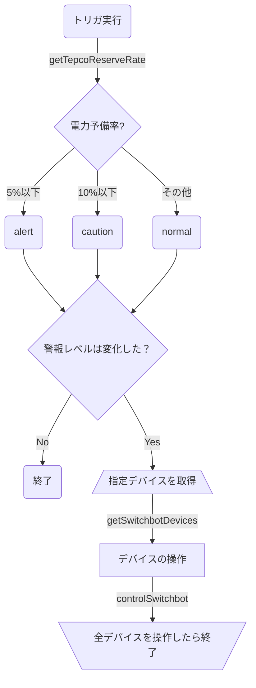

## はじめに
2022年の梅雨。大地を潤す雨はどこへやら、カンカン照りの太陽ばかりが降り注ぎ、猛暑が続きます。日経平均株価とは裏腹に高止まりする電力使用量、耳新しかった「**電力需給ひっ迫注意報**」は、いつしか耳タコ…

さて市井の民に何ができるか。むろん「**節電**」です。[^1]

電力ひっ迫の背景として、「[電力需給に関する検討会合（2022/06/07）](https://www.meti.go.jp/press/2022/06/20220607003/20220607003.html)」でも「コロナの影響による国民生活の行動様式・スタイルの変化による影響」が挙げられていますが、テレワークの普及で電気代が上がったという方も多いでしょう。（とくにエンジニア族は...）

東京電力は、節電でポイントがもらえるキャンペーン「[夏の節電チャレンジ2022](https://www.tepco.co.jp/ep/private/savingenergy/lp/challenge.html)」を実施し、これにお国も乗り気で[節電キャンペーンの参加者に**2,000円相当のポイント**を付与するつもり](https://www.nhk.or.jp/politics/articles/lastweek/85263.html)らしい。おまけに、[資源高で電気代もあがります。](https://www3.nhk.or.jp/news/html/20220629/k10013694641000.html)

お財布のため、隣家のため、お国のため、地球のため、節電のインセンティブは高まる一方です。ああ、なんだか節電したくなってきた。せっかくなら節電を楽しみたい...

と無駄な前置きはこれくらいにして、熱中症に気を付けつつ「**スマート節電**」をしてみよう、という大義名分にかこつけて、SwitchBotで遊んでみよう、というのが本稿です。

[^1]:「むろん」と書きましたが、世に「むろん」はないもので、太陽光パネルを自宅に設置する、クリーンエネルギーに投資する、地球温暖化対策など、個人レベルでも中長期的には論ずべきことがあるのは、論を俟ちません。

## やること
東京電力の電力状況（**予備率**）がある閾値を越えたら、エアコンの温度（と照明）を調整する。
具体的にはエアコンの温度を上げ、照明の照度（と色）を変える。

## 使うもの
- エアコン（1台）
- スマートフォン（SwitchBotアプリ）
- Google Apps Script
- [東京電力電力供給状況API](http://tepco-usage-api.appspot.com/)
  - その名の通り東京電力の電力供給状況を返すAPI。古い。
- SwitchBot
  - [ハブミニ](https://www.switchbot.jp/products/switchbot-hub-mini)
    - 赤外線リモコンを集約する、文字通りhubになるもの。これを介してエアコンを制御。
  - [温湿度計](https://www.switchbot.jp/products/switchbot-meter) (optional) 
    - 節電しすぎて熱中症にならないようにひと手間加えたい場合に使います。
  - [スマート電球](https://www.switchbot.jp/products/switchbot-color-blub)(optional)
    -  「電力需給ひっ迫注意報」を視覚化するために使います。なくてもよいです。

## 用語
本稿で出てくる用語をおさらいします。

### SwitchBot
スマートホーム用の様々な商品をお手頃価格で提供している、BtoCメインのIoTブランド。
「日本での利用者数100万世帯突破したスマートホームブランド」と[Twitterの日本語アカウント](https://twitter.com/SwitchBotJapan)のbio欄に書いてありました。隙あらば絵文字を入れてくる中の人がテンション高め系企業アカウントです。
2016年、クラウドファンディングプラットフォームの[kickstarter](https://www.kickstarter.com/projects/switchbot/switch-bot-the-worlds-smallest-remote-robot/description)発。開発者のWonderTechLabについてはあまり情報がありませんでした。デザインが白くて丸いので気に入っています。

なお、本稿はSwitchBot、SwitchBotと連呼しますが、回し者ではありません。スマートホーム用製品では、[Nature Remo](https://nature.global/nature-remo/nature-remo-mini/)も良さそうです。

### 東京電力管内
東京都、神奈川県、埼玉県、千葉県、栃木県、群馬県、茨城県、山梨県、静岡県（富士川以東）（[出典](https://tepco.zendesk.com/hc/ja/articles/360046063993)）
＊富士川以東なんですね。テストに出そうです。

### 電力需給ひっ迫注意報
2022年6月27日に初めて発令。予備率5％下回ると予想される場合に発令される。
「**電力需給ひっ迫警報**」は予備率3％下回ると予想される場合。

参考：NHK「[初の「電力需給ひっ迫注意報」 警報との違い すぐ使える節電方法」](https://www.nhk.or.jp/shutoken/newsup/20220627a.html)」（2022/06/27）

### 予備率
供給力（capacity）から電力需要を引いた値を "**予備力**"といい、それを**電力需要**で割ったレシオ。

$$
予備率=\frac{予備力 [供給力－電気の使用量(電力需要)]
}{電気の使用量(電力需要)
}\times 100
$$

使用率はこちら。

$$
使用率=\frac{電気の使用量(電力需要)}{供給力}\times 100
$$

分母が異なるので、使用率と予備率を足しても100%にはならないのですね。**電力需要**が分母というのがポイント。

（資料：[東京電力：＜参考資料＞使用率と予備率の計算方法（pdf）](https://www.tepco.co.jp/forecast/images/20220629.pdf)）

予測電力使用量は[こちら](https://www.tepco.co.jp/forecast/)で公開されています。電力使用のピークは15時～20時の時間帯、安定供給に最低限必要な予備率は3％。

## 今回の節電方法について
今回はエアコンはつけっぱなしにし、温度を調整することで節電します。こまめに消したり付けたりする方が節電効果が高いのかどうか、ホットな議論がありますが、ホットなのは気候だけで十分なので、在宅時間が長いという単純な決め手で温度調整派を採りました。

実際の電力使用量の推移を示さないと画竜点睛を欠くのですが、本稿ではしません。理由は面倒くさいからです。前提条件の開示など…

ぶっちゃけコードを書けばどういう条件でも実現できるので、最強の節電方法については読者諸賢のご見識と間取りと在宅時間とエアコンの機種に委ねる所存であります。いずれにせよ、節電によるSwitchBotの原価回収は不可でありましょう。

## 本題
いよいよコードを書いていきます。

### 東京電力電力供給状況APIから予備率を計算する
[東京電力電力供給状況API](http://tepco-usage-api.appspot.com/)のページに記載されているエンドポイントのうち、
`http://tepco-usage-api.appspot.com/quick.txt`
を使います。下記はサンプルレスポンスです。

```txt
7:30,3787,5824
```
左から`時刻,使用量,供給量`。
2011年のAPIでメンテ状況が怪しいのですが、東電の[電力使用状況データ](https://www.tepco.co.jp/forecast/html/juyo-j.html)と校合したところ、問題はなさそうです。

ここで予備率の式を再掲します。

$$
予備率=\frac{予備力 [供給力－電気の使用量(電力需要)]
}{電気の使用量(電力需要)
}\times 100
$$

Google Apps Scriptのプロジェクトを作成し、これをそのまま次の関数にします。

```js:getTepcoReserveRate
/**
 * @return {number} 東京電力管内の電力予備率
 */

function getTepcoReserveRate() {
  const tepco_endpoint = 'https://tepco-usage-api.appspot.com/quick.txt'
  const tepco_response = UrlFetchApp.fetch(tepco_endpoint).getContentText().split(",")
  const tepco_usage = tepco_response[1]
  const tepco_capacity = tepco_response[2]
  //予備率は小数点第1位まで有効。
  const reserve_rate = ((tepco_capacity - tepco_usage) / tepco_usage)*100
  const reserve_rate_rounded = Math.round(reserve_rate*10)/10
  console.info(`電力予備率：${reserve_rate_rounded}（${Utilities.formatDate(new Date(), "JST", "yyyy-MM-dd'T'HH:mm:ss'Z'")}）`)
  return reserve_rate_rounded
}
```
予備率の小数点は第2位で繰り上げです。

### SwitchBot APIの準備
SwitchBotにはシンプルなAPIが用意されています。
https://github.com/OpenWonderLabs/SwitchBotAPI

手始めにスマートフォンにSwitchBotのアプリをダウンロードします。
- [Android](https://play.google.com/store/apps/details?id=com.theswitchbot.switchbot&hl=ja&gl=US)
- [iOS](https://apps.apple.com/jp/app/switchbot/id1087374760)

ダウンロード後、アプリ上でハブミニにエアコンのリモコンを登録し、スマート電球、温湿度計もあわせてセットアップします。（この辺りの手順はアプリ上で直感的にわかりやすくできているので割愛します。）

続いて**API認証トークン**を発行します。
認証トークンはアプリの設定から、**「アプリバージョン」を10回タップ**すると出現する**開発者向けオプション**から取得できます。
|||
|:-:|:-:|
| プロフィール＞設定  | 「アプリバージョン」を10回タップ |

裏技みたいでワクワクします。

取得したトークンはGoogle Apps Scriptのスクリプトプロパティに`Switch_Bot_Token`をキーに登録します。


トークンは漏出すると家を乗っ取られます。

### SwitchBotたちを取得する（/v1.0/devices）
SwitchBot APIでSwitchBotの情報を取得します。
`/v1.0/devices`エンドポイントは例えば以下のようなレスポンスを返します。

```json:/v1.0/devicesのsample response
{
    "statusCode": 100,
    "body": {
        "deviceList": [
            {
                "deviceId": "500291B269BE",
                "deviceName": "Living Room Humidifier",
                "deviceType": "Humidifier",
                "enableCloudService": true,
                "hubDeviceId": "000000000000"
            }
        ],
        "infraredRemoteList": [
            {
                "deviceId": "02-202008110034-13",
                "deviceName": "Living Room TV",
                "remoteType": "TV",
                "hubDeviceId": "FA7310762361"
            }
        ]
    },
    "message": "success"
}
```
([APIドキュメント](https://github.com/OpenWonderLabs/SwitchBotAPI)より)

Switchbotハブミニで連携している機器、今回の場合はエアコンは`infraredRemoteList`というプロパティ内に配列として返されます。
一方、温湿度計やスマート電球は`deviceList`に入ります。`deviceId`、`deviceName`はユニーク値で、`deviceName`はアプリ上で設定した機器の名称になります。

これを踏まえ、`target_device_names`で指定した`deviceName`のオブジェクトデータの配列を返す関数を以下のように定義しました。`'Authorization'`ヘッダに先ほど登録したトークンを渡します。

```js:getSwitchbotDevices
function getSwitchbotDevices() {
  //コマンドを送るSwitchbotアプリの登録名（ユニーク）を指定。
  const target_device_names = ["エアコン", "スマート電球 7406"]
  try {
    const devices = UrlFetchApp.fetch('https://api.switch-bot.com/v1.0/devices',
      {
        headers: {
          'Authorization': PropertiesService.getScriptProperties().getProperty('Switch_Bot_Token'),
          'Content-Type': `application/json; charset=utf8`
        }
      })
    console.log(`GET /v1.0/devices:${devices}`)

    //SwitchBot Hubで連携しているVirtual infrared remote devicesの配列
    const devices_data = JSON.parse(devices).body
    const device_list = devices_data.deviceList
    const infrared_remote_list = devices_data.infraredRemoteList
    device_list.push(...infrared_remote_list)
    const target_devices = device_list.filter((device) => target_device_names.includes(device.deviceName))
    return target_devices
  }
  catch (e) {
    console.error(`GET /v1.0/devices Failed/${e}`)
    return
  }
}
```

#### 温湿度計で室温を取得する（Optional, v1.0/devices/$deviceId/status）
せっかくなので室温を取得してみます。

`meter_id`に先ほど取得した温湿度計の`deviceId`を記入します。
（スクリプトプロパティでの管理の方が良いかもしれません。）

```js:getRoomTemperature
function getRoomTemperature() {
  const meter_id = "<Your Meter deviceId>"
  const response = UrlFetchApp.fetch(`https://api.switch-bot.com/v1.0/devices/${meter_id}/status`,
    {
      headers: {
        'Authorization': PropertiesService.getScriptProperties().getProperty('Switch_Bot_Token'),
        'Content-Type': `application/json; charset=utf8`
      }
    })
  const room_temperature = JSON.parse(response).body.temperature
  if (room_temperature > 29) {
    console.warn(`室温：${room_temperature}`)
  }
  else {
    console.log(`室温：${room_temperature}`)
  }
  return room_temperature
}
```
これで室温が取得できます。29度を超えた場合は、`console.warn`として、ログ上で目立たせる小細工を施しました。

:::details 参考：温湿度計のsample response

```json
{
    "statusCode": 100,
    "body": {
        "deviceId": "C271111EC0AB",
        "deviceType": "Meter",
        "hubDeviceId": "FA7310762361",
        "humidity": 52,
        "temperature": 26.1
    },
    "message": "success"
}
```
:::

#### スマート電球の電源状態を確認する（Optional, v1.0/devices/$deviceId/status）
スマート電球の電源がOnになっている場合のみに照度を調整したいので、スマート電球の電源状態を取得してみます。これも`v1.0/devices/$deviceId/status`エンドポイントで実現可能です。

```js:isPowerOn
/**
 * @param {string} getSwitchbotDevices()で取得するdeviceId
 * @return {boolean} 電源が付いていればTrue、そうでなければFalse
 */

function isPowerOn(deviceId) {
  const device_state = UrlFetchApp.fetch(`https://api.switch-bot.com/v1.0/devices/${deviceId}/status`,
    {
      headers: {
        'Authorization': PropertiesService.getScriptProperties().getProperty('Switch_Bot_Token'),
        'Content-Type': `application/json; charset=utf8`
      }
    })
  const power_state = JSON.parse(device_state).body.power
  return power_state == "on" ? true : false
}
```
なお、ハブミニ経由でエアコンなどの`Virtual infrared remote devices`の電源のOn, Off情報は取得できないようです。（ご存知の方、ご教示ください。）

:::details 参考：スマート電球のSample Response

```json
{
    "statusCode": 100,
    "body": {
        "deviceId": "XXXXXX",
        "deviceType": "Color Bulb",
        "hubDeviceId": "6055F9287406",
        "power": "off",
        "brightness": 25,
        "color": "122: 80: 20",
        "colorTemperature": 0
    },
    "message": "success"
}
```
:::

### 実装する
メインの関数を実装していきます。
処理の流れは↓


### 状態と設定の定義
最初に状態と設定を決めます。

| 状態 | 定義 |
|:-:|:-:|
| normal  | 予備率が10%より大きい  |
| caution  | 予備率が10%以下 |
| alert  | 予備率が5%以下  |

先述のとおり「電力需給ひっ迫注意報」は5%、「電力需給ひっ迫警報」は3%が閾値なので、それよりは高く設定してみました。

それぞれの状態に対してエアコンと照明の設定を定義します。
例として通常は26℃、警報レベルとともに1℃ずつ上げてみました。
照明は徐々に落としていき、色も変えてみました。
```js:saveWithSwitchbot / configsの設定
 //エアコンの温度と照明の設定
  const configs = {
    'normal': {
      'temperature': 26,
      'brightness': 100,
      'color': "255:255:255",
      'colorTemperature':2700	
    },
    'caution': {
      'temperature': 27,
      'brightness': 50,
      'color': "102:107:190",
      'colorTemperature':2700	
    },
    'alert': {
      'temperature': 28,
      'brightness': 25,
      'color': "122:80:20",
      'colorTemperature':2700
    }
  }
```
### 予備率に応じて状態を決める
続いて前項で定義した関数で予備率を取得、それに応じてstateを定義します。
条件評価のところで先ほど決めた閾値を用います。

```js:saveWithSwitchbot / stateの定義
 //東京電力管内の電力予備率を取得
  const reserve_rate = getTepcoReserveRate()

  //電力予備率に応じて状態を定義
  const state = () => {
    if (reserve_rate <= 5) {
      return 'alert'
    }
    else if (reserve_rate <= 10) {
      return 'caution'
    }
    else {
      return 'normal'
    }
  }

```
さらに、状態が変化した場合だけスクリプトを実行したいので、スクリプトプロパティを用いて、前回実行の際の状態と比較し、変化がない場合は早期リターンさせます。
初回はnormalでスクリプトプロパティに設定しておきます。

```js:saveWithSwitchbot / state変化の検出
 const current_state = state()
 console.log(current_state)
 const previous_state = PropertiesService.getScriptProperties().getProperty("STATE")
  if (current_state == previous_state) {
    //前回実行からStateの変更がなければ実行しない
    return "There is no change of state"
  }
  PropertiesService.getScriptProperties().setProperty('STATE', current_state)
```
### デバイスの取得
`getSwitchbotDevices()`でデバイス情報のオブジェクトの配列を取得し、各デバイスを操作します。`controlSwitchbot(device, configs[current_state])`は次項で定義します。

```js:saveWithSwitchbot / デバイスの取得
//Switchbotのデバイスを取得
  const switchbot_devices = getSwitchbotDevices()
  if (switchbot_devices.length > 0) {
    //各デバイスごとにコマンドを送る。
    switchbot_devices.forEach(device => {
      controlSwitchbot(device, configs[current_state])
    })
  }
  else {
    console.error("No device found")
  }
```

### デバイスを操作する関数の作成
要となるデバイスの操作関数を作成します。

まずpostするコマンドの配列を作成します。コマンドは[APIドキュメント](https://github.com/OpenWonderLabs/SwitchBotAPI)にある形式で組み立てます。
たとえばエアコンは、
```json:エアコンへのコマンドの例
{
    "command": "setAll",
    "parameter": "26,1,3,on",
    "commandType": "command"
}
```
と`setAll`を使い、`parameter`に`{temperature},{mode},{fan speed},{power state}`を設定します。

デバイスの識別は`deviceType`でしていますが、複数機器をより細かく制御したければ、`deviceName`を使えるでしょう。

```js:controlSwitchbot / commandの作成
/**
 * Switchbotの操作関数
 * @param device {object[]} デバイスのオブジェクト
 * @param config {object} デバイスの設定情報
 * API Document: https://github.com/OpenWonderLabs/SwitchBotAPI#command-set-for-virtual-infrared-remote-devices
 */

function controlSwitchbot(device, config) {
  const switchbot_domain = 'https://api.switch-bot.com'
  const switchbot_endpoint = `${switchbot_domain}/v1.0/devices/${device.deviceId}/commands`

  //deviceのconfig情報をもとに、postするcommandを作成。
  const commands = (device) => {
    if (device.deviceType == "Color Bulb" && isPowerOn(device.deviceId)) {
      return [{
        "command": "setBrightness",
        "parameter": config.brightness,
        "commandType": "command"
      },
      {
        "command": "setColor",
        "parameter": config.color,
        "commandType": "command"
      }]
    }
    //室温が29℃以上の場合は熱中症防止で26℃設定、それ以上の場合は電力状況に応じて設定。
    else if (device.remoteType == "Air Conditioner") {
      const temperature = getRoomTemperature() >= 29 ? 26 : config.temperature
      return [{
        "command": "setAll",
        "parameter": `${temperature},1,1,"on"`,
        "commandType": "command"
      }]
    }
    else{
      return [false]
    }
  }
```
熱中症対策として、先に定義した`getRoomTemperature()`を使い、室温が29℃を越えている場合は強制的に26℃に設定するようにしています。東京電力さん、ごめんなさい。

続いて配列になっているコマンドを一つ一つ実行します。
```js:controlSwitchbot / API実行
  commands(device).forEach((command)=>{
  if (!command) {
    return console.log(`No Command Executed: ${device.deviceName}`)
  }

  const options = {
    headers: {
      'Authorization': PropertiesService.getScriptProperties().getProperty('Switch_Bot_Token'),
      'Content-Type': `application/json; charset=utf8`
    },
    payload: JSON.stringify(command)
  }
  try {
    const response = JSON.parse(UrlFetchApp.fetch(switchbot_endpoint, options))
    if (response.statusCode == 100) {
      console.log(`${device.deviceName}: ${options.payload}=>${JSON.stringify(response)}`)
    }
    else {
      console.error(`${device.deviceName}:${response}`)
    }
  }
  catch (e) {
    console.error(`Error Occurred while executing ${command}
    ErrorLog:${e}`)
  }
  })
}
```

これで完成です。最後にコードの全体図を折りたたんで置いておきます。

:::details　コードの全体図

```js
function saveWithSwitchbot() {
  //エアコンの温度と照明の設定
  const configs = {
    'normal': {
      'temperature': 26,
      'brightness': 100,
      'color': "255:255:255",
      'colorTemperature':2700	
    },
    'caution': {
      'temperature': 27,
      'brightness': 50,
      'color': "102:107:190",
      'colorTemperature':2700	
    },
    'alert': {
      'temperature': 28,
      'brightness': 25,
      'color': "122:80:20",
      'colorTemperature':2700
    }
  }
  //東京電力管内の電力予備率を取得
  const reserve_rate = getTepcoReserveRate()

  //電力予備率に応じて状態を定義
  const state = () => {
    if (reserve_rate <= 5) {
      return 'alert'
    }
    else if (reserve_rate <= 10) {
      return 'caution'
    }
    else {
      return 'normal'
    }
  }

  const current_state = state()
  console.log(current_state)
  const previous_state = PropertiesService.getScriptProperties().getProperty("STATE")
  if (current_state == previous_state) {
    //前回実行からStateの変更がなければ実行しない
    return "There is no change of state"
  }
  PropertiesService.getScriptProperties().setProperty('STATE', current_state)

  //Switchbotのデバイスを取得
  const switchbot_devices = getSwitchbotDevices()
  if (switchbot_devices.length > 0) {
    //各デバイスごとにコマンドを送る。
    switchbot_devices.forEach(device => {
      controlSwitchbot(device, configs[current_state])
    })
  }
  else {
    console.error("No device found")
  }
}

/**
 * @return {number} 東京電力管内の電力予備率
 */

function getTepcoReserveRate() {
  const tepco_endpoint = 'https://tepco-usage-api.appspot.com/quick.txt'
  const tepco_response = UrlFetchApp.fetch(tepco_endpoint).getContentText().split(",")
  const tepco_usage = tepco_response[1]
  const tepco_capacity = tepco_response[2]
  //予備率は小数点第1位まで有効。
  const reserve_rate = ((tepco_capacity - tepco_usage) / tepco_usage)*100
  const reserve_rate_rounded = Math.round(reserve_rate*10)/10
  console.info(`電力予備率：${reserve_rate_rounded}（${Utilities.formatDate(new Date(), "JST", "yyyy-MM-dd'T'HH:mm:ss'Z'")}）`)
  return reserve_rate_rounded
}

/**
 * Switchbotの操作関数
 * @param device {object[]} デバイスのオブジェクト
 * @param config {object} デバイスの設定情報
 * API Document: https://github.com/OpenWonderLabs/SwitchBotAPI#command-set-for-virtual-infrared-remote-devices
 */

function controlSwitchbot(device, config) {
  const switchbot_domain = 'https://api.switch-bot.com'
  const switchbot_endpoint = `${switchbot_domain}/v1.0/devices/${device.deviceId}/commands`

  //deviceのconfig情報をもとに、postするcommandを作成。
  const commands = (device) => {
    if (device.deviceType == "Color Bulb" && isPowerOn(device.deviceId)) {
      return [{
        "command": "setBrightness",
        "parameter": config.brightness,
        "commandType": "command"
      },
      {
        "command": "setColor",
        "parameter": config.color,
        "commandType": "command"
      }]
    }
    //室温が29℃以上の場合は熱中症防止で26℃設定、それ以上の場合は電力状況に応じて設定。
    else if (device.remoteType == "Air Conditioner") {
      const temperature = getRoomTemperature() >= 29 ? 26 : config.temperature
      return [{
        "command": "setAll",
        "parameter": `${temperature},1,1,"on"`,
        "commandType": "command"
      }]
    }
    else{
      return [false]
    }
  }

  commands(device).forEach((command)=>{
  if (!command) {
    return console.log(`No Command Executed: ${device.deviceName}`)
  }

  const options = {
    headers: {
      'Authorization': PropertiesService.getScriptProperties().getProperty('Switch_Bot_Token'),
      'Content-Type': `application/json; charset=utf8`
    },
    payload: JSON.stringify(command)
  }
  try {
    const response = JSON.parse(UrlFetchApp.fetch(switchbot_endpoint, options))
    if (response.statusCode == 100) {
      console.log(`${device.deviceName}: ${options.payload}=>${JSON.stringify(response)}`)
    }
    else {
      console.error(`${device.deviceName}:${response}`)
    }
  }
  catch (e) {
    console.error(`Error Occurred while executing ${command}
    ErrorLog:${e}`)
  }
  })
}

/**
 * 配列で指定したデバイス名と合致するデバイスのオブジェクトデータの配列を返す
 * @return {object[]]	
 * [ { deviceId: '02-111111111-22222222',
    deviceName: '電気',
    remoteType: 'Light',
    hubDeviceId: 'AAAAAAAAAAA' },
  { deviceId: '02-333333333-44444444',
    deviceName: 'エアコン',
    remoteType: 'Air Conditioner',
    hubDeviceId: 'XXXXXXXXXXX' } ]
 */

function getSwitchbotDevices() {
  //コマンドを送るSwitchbotアプリの登録名（ユニーク）を指定。
  const target_device_names = ["エアコン", "スマート電球 7406"]
  try {
    const devices = UrlFetchApp.fetch('https://api.switch-bot.com/v1.0/devices',
      {
        headers: {
          'Authorization': PropertiesService.getScriptProperties().getProperty('Switch_Bot_Token'),
          'Content-Type': `application/json; charset=utf8`
        }
      })
    console.log(`GET /v1.0/devices:${devices}`)

    //SwitchBot Hubで連携しているVirtual infrared remote devicesの配列
    const devices_data = JSON.parse(devices).body
    const device_list = devices_data.deviceList
    const infrared_remote_list = devices_data.infraredRemoteList
    device_list.push(...infrared_remote_list)
    const target_devices = device_list.filter((device) => target_device_names.includes(device.deviceName))
    return target_devices
  }
  catch (e) {
    console.error(`GET /v1.0/devices Failed/${e}`)
    return
  }
}

/**
 * 室温を取得
 * sample response
 * {
    "statusCode": 100,
    "body": {
        "deviceId": "C271111EC0AB",
        "deviceType": "Meter",
        "hubDeviceId": "FA7310762361",
        "humidity": 52,
        "temperature": 26.1
    },
    "message": "success"
}
 */

function getRoomTemperature() {
  const meter_id = "<Your Meter deviceId>"
  const response = UrlFetchApp.fetch(`https://api.switch-bot.com/v1.0/devices/${meter_id}/status`,
    {
      headers: {
        'Authorization': PropertiesService.getScriptProperties().getProperty('Switch_Bot_Token'),
        'Content-Type': `application/json; charset=utf8`
      }
    })
  const room_temperature = JSON.parse(response).body.temperature
  if (room_temperature > 29) {
    console.warn(`室温：${room_temperature}`)
  }
  else {
    console.log(`室温：${room_temperature}`)
  }
  return room_temperature
}

/**
 * @param {string} getSwitchbotDevices()で取得するdeviceId
 * @return {boolean} 電源が付いていればTrue、そうでなければFalse
 */

function isPowerOn(deviceId) {
  const device_state = UrlFetchApp.fetch(`https://api.switch-bot.com/v1.0/devices/${deviceId}/status`,
    {
      headers: {
        'Authorization': PropertiesService.getScriptProperties().getProperty('Switch_Bot_Token'),
        'Content-Type': `application/json; charset=utf8`
      }
    })
 
  const power_state = JSON.parse(device_state).body.power
  return power_state == "on" ? true : false
}
```
:::

### スクリプトトリガの設定
出来上がったスクリプトを定期実行させるためのトリガを設定します。
Google Apps Scriptのサイドバーより目覚まし時計のマークをクリック、試みに30分おきの実行でトリガ設定しました。


#### 外出時にエアコンを消したい場合は・・・
このスクリプトは外出時に警報レベルが変わると、消していたエアコンの電源がOnになる欠陥があります。エアコンの電源ステータスを取得できればよいのですが、ハブミニ経由の`Virtual infrared remote devices`は取得できないようです。
もし実装したいのであれば、「[SwitchBot開閉センサー](https://www.switchbot.jp/products/switchbot-contact-sensor)」を使ったり、外出フラグをGoogle Apps Scriptに渡すなり、工夫が必要です。

## おわりに
東京電力の電力供給のひっ迫を検知し、自動で節電するスクリプトを作ってみました。
実際の節電効果はなお検証が必要ですが、SwitchBotの操作を一通り触ることができたので本稿としては十分とします。消費電力の検証には[SwitchBotプラグ](https://www.switchbot.jp/products/switchbot-plug)も使えそうです。

副次的な気づきですが、ある条件によって照明が変えられることで、各種警報の視覚的なシグナルになり、案外効果的だと感じました。

[夏の節電チャレンジ2022](https://www.tepco.co.jp/ep/private/savingenergy/lp/challenge.html)など節電周りの取り組みも活性化してきているので、みなさんも楽しみながら節電してみてください。

## 参考文献・サイト
### 東京電力
- [＜参考資料＞使用率と予備率の計算方法（pdf）](https://www.tepco.co.jp/forecast/images/20220629.pdf)）

- [夏の節電チャレンジ2022](https://www.tepco.co.jp/ep/private/savingenergy/lp/challenge.html)

### 経済産業省
- [電力需給に関する検討会合（2022/06/07）](https://www.meti.go.jp/press/2022/06/20220607003/20220607003.html)

### NHK
- [【参加方法は？】“節電でポイント2000円相当” 8月中めどに制度開始へ](https://www.nhk.or.jp/politics/articles/lastweek/85263.html)

- [ことし8月分の電気料金 大手電力10社のうち4社で値上がりへ](https://www3.nhk.or.jp/news/html/20220629/k10013694641000.html)

- [初の「電力需給ひっ迫注意報」 警報との違い すぐ使える節電方法](https://www.nhk.or.jp/shutoken/newsup/20220627a.html)

### SwitchBot関連
- [SwitchBotをHub経由でAPIから操作する](https://qiita.com/itouuuuuuuuu/items/874cd992f473f30de45b)

### その他
#### console.xxx
- [JavaScriptでの賢いconsole.log( )の使い方 & その他便利なconsole.xxx( )使い方まとめ (dir・table・warn・groupとか)](
https://qiita.com/mtoyopet/items/7274761af5424cee342a)
